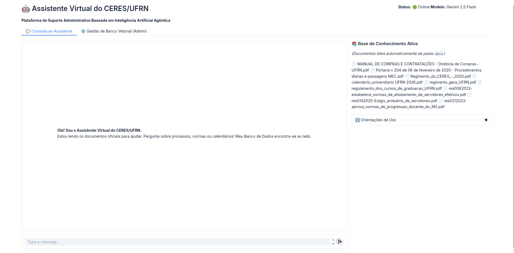
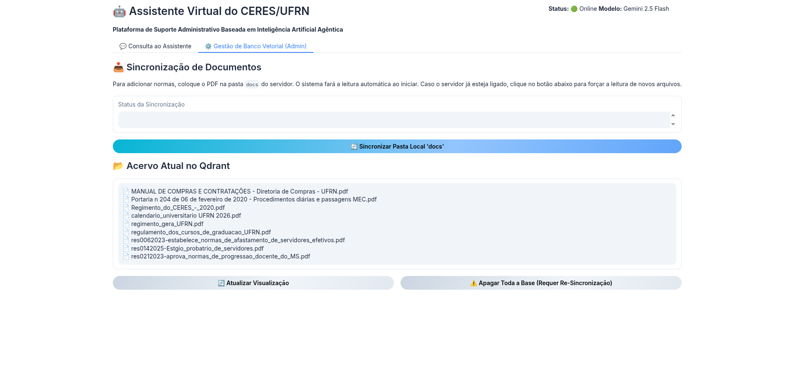
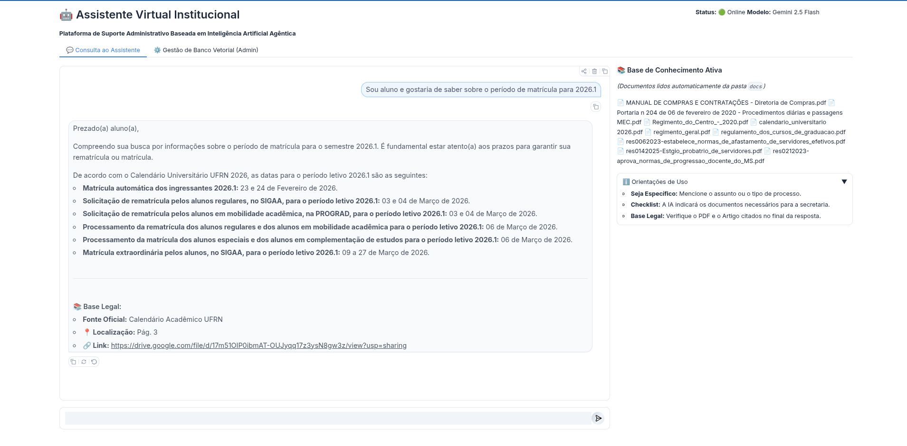

<div align="center">


# ASSIST-CERES

### Assistente Inteligente de Suporte e Sistematização Informacional do Centro de Ensino Superior do Seridó

**Produto Técnico-Tecnológico (PTT)**  
Universidade Federal do Rio Grande do Norte — UFRN  
Centro de Ciências Humanas, Letras e Artes — CCHLA  
Programa de Pós-Graduação em Gestão de Processos Institucionais — PPGPI  

*Trabalho de Conclusão de Curso de Mestrado Profissional*

---

**Autor:** Eli Edson Cabral de Lima Júnior  
**Orientador:** Prof. Dr. Valdemir Galvão de Carvalho  
**Ano:** 2026

---

[](LICENSE)
[](https://www.python.org/)
[]()
[]()
[](https://posgraduacao.ufrn.br/ppgpi)

</div>

---

## Sumário

- [1. Apresentação](#1-apresentação)
- [2. Problema institucional](#2-problema-institucional)
- [3. Solução proposta](#3-solução-proposta)
- [4. Aviso de uso responsável](#4-aviso-de-uso-responsável)
- [5. Arquitetura técnica](#5-arquitetura-técnica)
- [6. Créditos e base de desenvolvimento](#6-créditos-e-base-de-desenvolvimento)
- [7. Demonstração](#7-demonstração)
- [8. Instalação](#8-instalação)
- [9. Configuração](#9-configuração)
- [10. Uso](#10-uso)
- [11. Estrutura do repositório](#11-estrutura-do-repositório)
- [12. Replicabilidade](#12-replicabilidade)
- [13. Limitações conhecidas](#13-limitações-conhecidas)
- [14. Roadmap](#14-roadmap)
- [15. Como citar](#15-como-citar)
- [16. Licença](#16-licença)
- [17. Contato](#17-contato)
- [18. Alinhamento aos ODS](#18-alinhamento-aos-ods)

---

## 1. Apresentação

O **ASSIST-CERES** é um assistente conversacional de inteligência artificial baseado em arquitetura agêntica de *Retrieval-Augmented Generation* (RAG), desenvolvido como **Produto Técnico-Tecnológico (PTT)** do Trabalho de Conclusão de Curso de Mestrado Profissional do Programa de Pós-Graduação em Gestão de Processos Institucionais (PPGPI) da Universidade Federal do Rio Grande do Norte (UFRN).

O produto foi concebido para apoiar os **Técnicos-Administrativos em Educação (TAEs)** do Centro de Ensino Superior do Seridó (CERES/UFRN) na recuperação tempestiva, rastreável e contextualizada de informações administrativas, normativas e procedimentais.

> **Classificação no Programa:** ferramenta tecnológica — artefato de software.  
> **Versão atual:** Prova de Conceito (PoC) funcional.  
> **Evolução prevista:** Produto Mínimo Viável (MVP) institucional, condicionado à ampliação do corpus documental, à governança informacional e à integração com sistemas institucionais.

---

## 2. Problema institucional

Pesquisa qualitativa conduzida com TAEs do CERES/UFRN identificou um cenário recorrente de **fragmentação informacional** e **sobrecarga cognitiva** no acesso a informações administrativas.

Entre os principais problemas identificados, destacam-se:

- procedimentos administrativos dispersos em múltiplos sistemas, como SIPAC, SIGAA e SIGRH;
- informações distribuídas em sites institucionais, resoluções, manuais, comunicados e mensagens informais;
- dependência do conhecimento tácito de servidores mais experientes;
- inconsistências procedimentais entre o campus central, em Natal, e a unidade do interior, em Caicó;
- insegurança decisória, retrabalho e ônus reputacional sobre os técnicos;
- lacunas normativas em áreas críticas, especialmente no domínio de diárias e passagens.

> *"Demorei duas horas para resolver algo que deveria ser simples."*  
> — Participante P1, grupo focal

---

## 3. Solução proposta

O **ASSIST-CERES** atua como uma camada de apoio à mediação informacional entre o usuário e o corpus documental institucional. O sistema busca documentos relevantes, recupera trechos normativos, organiza o contexto e gera respostas em linguagem natural, sempre com indicação da base legal utilizada.

| Característica | Diferencial |
|---|---|
| **Ancoragem rastreável** | Cada resposta deve indicar a base legal e o hiperlink para o documento oficial. |
| **Arquitetura agêntica** | O sistema pode analisar a pergunta, reescrever consultas e executar ciclos corretivos de recuperação. |
| **Busca híbrida** | Combina recuperação semântica densa com busca lexical esparsa, baseada em BM25. |
| **Engenharia de contexto** | Utiliza segmentação hierárquica *Parent-Child Chunking* para preservar o contexto documental. |
| **Mitigação de alucinações** | O padrão ReAct (*Reasoning and Acting*) força o uso de ferramentas de recuperação antes da resposta final. |
| **Despersonalização do conhecimento** | Reduz a dependência exclusiva do conhecimento informal de servidores experientes. |
| **Consulta e diagnóstico** | Apoia o usuário na busca por informação e também evidencia lacunas documentais da instituição. |

---

## 4. Aviso de uso responsável

O ASSIST-CERES é uma ferramenta de apoio à recuperação de informações institucionais. Suas respostas devem ser conferidas pelo usuário a partir da base legal indicada.

O sistema **não substitui**:

- parecer jurídico;
- decisão administrativa;
- validação da chefia competente;
- consulta aos setores responsáveis;
- leitura do documento oficial;
- políticas institucionais de governança documental.

A qualidade das respostas depende diretamente da qualidade, atualidade e completude do corpus documental utilizado. Quando a instituição não possui documento suficiente sobre determinado fluxo, o sistema deve indicar a limitação em vez de produzir uma resposta sem base oficial.

---

## 5. Arquitetura técnica

O sistema foi estruturado em camadas modulares, combinando orquestração agêntica, recuperação documental, geração de respostas e rastreabilidade.

```text
┌─────────────────────────────────────────────────────────────┐
│  [7] Rastreabilidade — logs JSONL com timestamps ISO        │
├─────────────────────────────────────────────────────────────┤
│  [6] Interface — Gradio (abas Consulta + Admin)             │
├─────────────────────────────────────────────────────────────┤
│  [5] Engenharia de prompt — system prompts especializados   │
├─────────────────────────────────────────────────────────────┤
│  [4] Inferência — Google Gemini 2.5 Flash + padrão ReAct    │
├─────────────────────────────────────────────────────────────┤
│  [3] Persistência vetorial — Qdrant + Hybrid Search         │
├─────────────────────────────────────────────────────────────┤
│  [2] Ingestão — pymupdf4llm + Parent-Child Chunking         │
├─────────────────────────────────────────────────────────────┤
│  [1] Orquestração agêntica — LangGraph (State Graphs)       │
└─────────────────────────────────────────────────────────────┘
```

### Stack tecnológica

| Camada | Tecnologia | Função |
|---|---|---|
| Linguagem | Python 3.10+ | Linguagem principal do projeto. |
| Orquestração | LangGraph | Controle do fluxo agêntico por grafos de estado. |
| Modelo fundacional | Google Gemini 2.5 Flash | Geração das respostas em linguagem natural. |
| Banco vetorial | Qdrant | Armazenamento vetorial e busca híbrida. |
| Embeddings | FastEmbed / modelos densos e esparsos | Representação semântica e lexical dos documentos. |
| Conversão PDF | pymupdf4llm | Conversão de PDFs para Markdown. |
| Interface | Gradio | Interface web de consulta e administração. |
| Logs | JSONL | Registro das interações para rastreabilidade. |

---

## 6. Créditos e base de desenvolvimento

O ASSIST-CERES foi desenvolvido a partir de uma **adaptação técnica aplicada** do projeto **Agentic RAG for Dummies**, de Giovanni Pasquini, disponível publicamente no GitHub.

O projeto-base apresenta uma arquitetura modular de Agentic RAG com LangGraph, incluindo indexação hierárquica, recuperação documental, memória conversacional, reescrita/clarificação de consultas, orquestração de agentes, execução em padrão Map-Reduce e mecanismos de autocorreção.

A partir dessa base, o ASSIST-CERES foi customizado para o contexto institucional do CERES/UFRN, com as seguintes adaptações principais:

- substituição do domínio genérico pelo corpus normativo e administrativo da UFRN;
- adequação dos prompts ao contexto dos Técnicos-Administrativos em Educação;
- incorporação de respostas com base legal e hiperlinks institucionais;
- adaptação da interface para uso no CERES/UFRN;
- ajustes nos fluxos de recuperação para documentos administrativos e normativos;
- organização do produto como Produto Técnico-Tecnológico do PPGPI/UFRN;
- avaliação qualitativa com usuários reais no contexto de trabalho dos TAEs.

Dessa forma, o ASSIST-CERES não consiste em mera reprodução do projeto-base, mas em uma adaptação aplicada, contextualizada e avaliada qualitativamente para um problema real de gestão informacional em instituição pública de ensino superior.

**Projeto-base:**

PASQUINI, Giovanni. **Agentic RAG for Dummies**. GitHub, 2025. Disponível em: <https://github.com/GiovanniPasq/agentic-rag-for-dummies>. Acesso em: 3 maio 2026.

---

## 7. Demonstração


### Aba "Consulta ao Assistente"





### Aba "Gestão de Banco Vetorial (Admin)"





### Exemplo de interação

**Pergunta do usuário:**

> Sou aluno e gostaria de saber sobre o período de matrícula para 2026.1?

**Resposta do ASSIST-CERES:**



---

## 8. Instalação

### Pré-requisitos

- Python 3.10 ou superior;
- Git;
- chave de API do Google Gemini;
- acesso à internet;
- mínimo recomendado de 4 GB de RAM disponível;
- documentos institucionais em PDF para composição do corpus.

### Clonar o repositório

```bash
git clone https://github.com/eliedsonjr/mestrado-rag-agentico-ppggpi-ufrn.git
cd mestrado-rag-agentico-ppggpi-ufrn/project
```

### Criar ambiente virtual

```bash
python -m venv venv
```

### Ativar ambiente virtual

Linux/Mac:

```bash
source venv/bin/activate
```

Windows:

```bash
venv\Scripts\activate
```

### Instalar dependências

Como o arquivo `requirements.txt` está localizado na raiz do repositório, a partir da pasta `project`, execute:

```bash
pip install -r ../requirements.txt
```

### Configurar a chave da API

Linux/Mac:

```bash
export GOOGLE_API_KEY="sua-chave-api-aqui"
```

Windows:

```bash
set GOOGLE_API_KEY=sua-chave-api-aqui
```

### Executar a aplicação

```bash
python app.py
```

A interface local será disponibilizada no endereço indicado pelo Gradio, geralmente:

```text
http://localhost:7860
```

---

## 9. Configuração

### Variáveis de ambiente

A principal variável necessária para execução do sistema é:

```env
GOOGLE_API_KEY=sua-chave-api-aqui
```

Quando forem utilizados serviços externos de banco vetorial ou configurações específicas de ambiente, recomenda-se documentar também variáveis como:

```env
QDRANT_URL=http://localhost:6333
MODEL_NAME=gemini-2.5-flash
```

### Hiperparâmetros de fragmentação

Os parâmetros de fragmentação devem permanecer alinhados ao TCC, ao código e à documentação técnica.

| Parâmetro | Valor de referência | Descrição |
|---|---:|---|
| `CHILD_CHUNK_SIZE` | 500 | Tamanho dos blocos menores utilizados para indexação e recuperação. |
| `CHILD_CHUNK_OVERLAP` | 100 | Sobreposição entre blocos *child* para evitar perda de contexto. |
| `MIN_PARENT_SIZE` | 2.000 | Tamanho mínimo dos blocos ampliados de contexto. |
| `MAX_PARENT_SIZE` | 10.000 | Tamanho máximo dos blocos ampliados enviados ao modelo. |
| `TEMPERATURE` | 0.0 | Valor determinístico para reduzir criatividade e mitigar alucinações em respostas normativas. |

---

## 10. Uso

### Aba "Consulta ao Assistente"

1. Digite sua dúvida em linguagem natural.
2. Aguarde o processamento.
3. Verifique a resposta gerada.
4. Confira a base legal apresentada.
5. Abra o hiperlink da fonte oficial, quando disponível.
6. Valide a resposta antes de utilizá-la em comunicação formal ou decisão administrativa.

### Aba "Gestão de Banco Vetorial"

1. Faça upload dos documentos PDF oficiais.
2. Aguarde o processamento de ingestão.
3. Verifique se os documentos foram indexados corretamente.
4. Realize perguntas de teste.
5. Atualize a base sempre que houver nova norma ou documento institucional.

### Boas práticas de prompting

- formule perguntas claras e autossuficientes;
- informe o processo, norma ou tema desejado;
- evite perguntas excessivamente amplas;
- use termos técnicos quando souber;
- caso a resposta fique incompleta, reformule a pergunta;
- confira sempre a base legal indicada;
- reporte lacunas ou respostas problemáticas ao responsável pelo sistema.

---

## 11. Estrutura do repositório

A estrutura abaixo reflete a organização atual do projeto.

```text
mestrado-rag-agentico-ppggpi-ufrn/
├── project/
│   ├── core/
│   │   ├── rag_system.py
│   │   ├── document_manager.py
│   │   └── chat_interface.py
│   ├── db/
│   │   ├── vector_db_manager.py
│   │   └── parent_store_manager.py
│   ├── rag_agent/
│   │   ├── graph.py
│   │   ├── graph_state.py
│   │   ├── nodes.py
│   │   ├── edges.py
│   │   ├── tools.py
│   │   ├── prompts.py
│   │   └── schemas.py
│   ├── ui/
│   │   ├── css.py
│   │   └── gradio_app.py
│   ├── app.py
│   ├── config.py
│   ├── document_chunker.py
│   ├── util.py
│   └── README.md
├── requirements.txt
├── LICENSE
└── README.md
```

### Descrição dos principais módulos

| Módulo | Função |
|---|---|
| `project/app.py` | Ponto de entrada da aplicação. |
| `project/config.py` | Centralização dos parâmetros de configuração. |
| `project/document_chunker.py` | Fragmentação hierárquica dos documentos. |
| `project/util.py` | Funções auxiliares, incluindo conversão e preparação documental. |
| `project/core/` | Camada de integração do sistema RAG e interface conversacional. |
| `project/db/` | Gerenciamento do banco vetorial e armazenamento de blocos parent. |
| `project/rag_agent/` | Grafos, nós, arestas, prompts, ferramentas e esquemas do agente. |
| `project/ui/` | Interface Gradio e customização visual. |

---

## 12. Replicabilidade

O ASSIST-CERES foi projetado para ser adaptado a outras unidades acadêmicas e instituições públicas que enfrentem problemas semelhantes de dispersão documental e sobrecarga informacional.

### Passo 1 — Substituir o corpus documental

Substitua os documentos do corpus pelos normativos da instituição ou unidade de aplicação. Recomenda-se utilizar:

- resoluções;
- regimentos;
- manuais;
- portarias;
- guias de procedimentos;
- calendários acadêmicos;
- fluxogramas validados.

### Passo 2 — Ajustar os prompts

Edite os prompts do sistema para refletir:

- nome da instituição;
- nomes dos sistemas estruturantes locais;
- terminologia administrativa;
- documentos oficiais prioritários;
- links institucionais.

### Passo 3 — Calibrar parâmetros

Ajuste os hiperparâmetros conforme:

- volume documental;
- tamanho médio dos documentos;
- perfil dos usuários;
- tempo de resposta aceitável;
- custo de inferência;
- necessidade de precisão normativa.

### Contextos de uso recomendados

- centros acadêmicos da UFRN;
- pró-reitorias;
- departamentos acadêmicos;
- secretarias administrativas;
- outras universidades federais e estaduais;
- institutos federais;
- órgãos públicos com alta densidade normativa.

---

## 13. Limitações conhecidas

| Limitação | Mitigação recomendada |
|---|---|
| **Latência por consulta** | Uso de modelo leve, otimização do corpus e testes de desempenho. |
| **Curva de aprendizado em prompting** | Capacitação dos usuários e exemplos de boas perguntas. |
| **Dependência da qualidade do corpus** | Curadoria documental contínua e validação por setor responsável. |
| **Lacunas normativas institucionais** | Registro das ausências e comunicação aos setores competentes. |
| **Custo de API** | Monitoramento de uso e avaliação futura de modelos locais. |
| **Ausência de integração nativa com SIGs** | Planejamento de integração futura via APIs institucionais, quando disponível. |
| **Dependência de projeto-base** | Preservação da atribuição a Pasquini e documentação clara das adaptações realizadas. |

---

## 14. Roadmap

### Curto prazo — 3 a 6 meses

- [ ] Criar release estável `v1.0-ppgpi`.
- [ ] Inserir capturas de tela reais no repositório.
- [ ] Publicar vídeo curto de demonstração.
- [ ] Melhorar documentação de instalação para Windows e Linux.
- [ ] Criar base de perguntas frequentes para usuários.
- [ ] Incluir arquivo `NOTICE` ou seção equivalente preservando a atribuição ao projeto-base de Pasquini.

### Médio prazo — 6 a 12 meses

- [ ] Ampliar o corpus documental.
- [ ] Criar rotina de auditoria das respostas.
- [ ] Implementar módulo de feedback dos usuários.
- [ ] Aprimorar camada de tradução semântica entre linguagem natural e terminologia institucional.
- [ ] Avaliar integração com SIPAC, SIGAA e SIGRH.

### Longo prazo — 12 a 24 meses

- [ ] Desenvolver arquitetura multiagente por domínio normativo.
- [ ] Criar painel analítico de lacunas documentais para gestores.
- [ ] Avaliar uso em outras unidades acadêmicas da UFRN.
- [ ] Adaptar o sistema para outras IES brasileiras.
- [ ] Estudar migração parcial ou total para modelos locais.

---

## 15. Como citar

### Produto desenvolvido

LIMA JÚNIOR, Eli Edson Cabral de. **Protótipo de chatbot Retrieval-Augmented Generation (RAG) como ferramenta de apoio à gestão informacional**: um estudo com técnicos-administrativos no Centro de Ensino Superior do Seridó (UFRN). 2026. Trabalho de Conclusão de Curso (Mestrado Profissional em Gestão de Processos Institucionais) — Centro de Ciências Humanas, Letras e Artes, Universidade Federal do Rio Grande do Norte, Natal, 2026.

### Projeto-base utilizado como referência técnica

PASQUINI, Giovanni. **Agentic RAG for Dummies**. GitHub, 2025. Disponível em: <https://github.com/GiovanniPasq/agentic-rag-for-dummies>. Acesso em: 3 maio 2026.

### BibTeX

```bibtex
@mastersthesis{limajunior2026assistceres,
  author       = {Eli Edson Cabral de Lima Júnior},
  title        = {Protótipo de chatbot Retrieval-Augmented Generation (RAG)
                  como ferramenta de apoio à gestão informacional:
                  um estudo com técnicos-administrativos no Centro de Ensino
                  Superior do Seridó (UFRN)},
  school       = {Universidade Federal do Rio Grande do Norte},
  year         = {2026},
  address      = {Natal, RN},
  type         = {Trabalho de Conclusão de Curso (Mestrado Profissional em
                  Gestão de Processos Institucionais)},
  url          = {https://github.com/eliedsonjr/mestrado-rag-agentico-ppggpi-ufrn}
}

@misc{pasquini2025agenticrag,
  author       = {Giovanni Pasquini},
  title        = {Agentic RAG for Dummies},
  year         = {2025},
  howpublished = {GitHub repository},
  url          = {https://github.com/GiovanniPasq/agentic-rag-for-dummies}
}
```

---

## 16. Licença

Este projeto é distribuído sob a [Licença MIT](LICENSE), permitindo uso, cópia, modificação e distribuição, desde que mantida a atribuição original.

Partes da arquitetura e da estrutura de desenvolvimento foram adaptadas do projeto **Agentic RAG for Dummies**, de Giovanni Pasquini, também disponibilizado sob Licença MIT. A atribuição ao projeto-base é preservada neste README e deve ser mantida em eventuais redistribuições, juntamente com o aviso de licença correspondente.

Recomenda-se incluir no repositório um arquivo `NOTICE` ou seção equivalente contendo a referência ao projeto-base e ao aviso de copyright original:

```text
This project adapts concepts and components from Agentic RAG for Dummies,
Copyright (c) 2025 Giovanni Pasqualino, licensed under the MIT License.
Original repository: https://github.com/GiovanniPasq/agentic-rag-for-dummies
```

---

## 17. Contato

**Eli Edson Cabral de Lima Júnior**  
Mestrando em Gestão de Processos Institucionais — PPGPI/UFRN  
Técnico-Administrativo em Educação — CERES/UFRN  

E-mail: eli.edson.junior@ufrn.br  
LinkedIn: [https://linkedin.com/in/eliedsonjr](https://linkedin.com/in/eliedsonjr)

**Orientador:** Prof. Dr. Valdemir Galvão de Carvalho — PPGPI/UFRN

---

## 18. Alinhamento aos ODS

Este projeto está alinhado aos seguintes Objetivos de Desenvolvimento Sustentável (ODS) da Agenda 2030 da ONU:

| ODS | Relação com o projeto |
|---|---|
| **ODS 4 — Educação de Qualidade** | Apoia fluxos administrativos que sustentam o funcionamento do ensino superior público. |
| **ODS 9 — Indústria, Inovação e Infraestrutura** | Aplica tecnologia de IA generativa em contexto institucional público. |
| **ODS 16 — Paz, Justiça e Instituições Eficazes** | Fortalece transparência, rastreabilidade e acesso à informação pública. |

---

<div align="center">

*Desenvolvido como Produto Técnico-Tecnológico (PTT) no âmbito do Programa de Pós-Graduação em Gestão de Processos Institucionais — PPGPI/UFRN.*

**Universidade Federal do Rio Grande do Norte — Centro de Ensino Superior do Seridó**

*Natal, RN | Caicó, RN | 2026*

</div>
